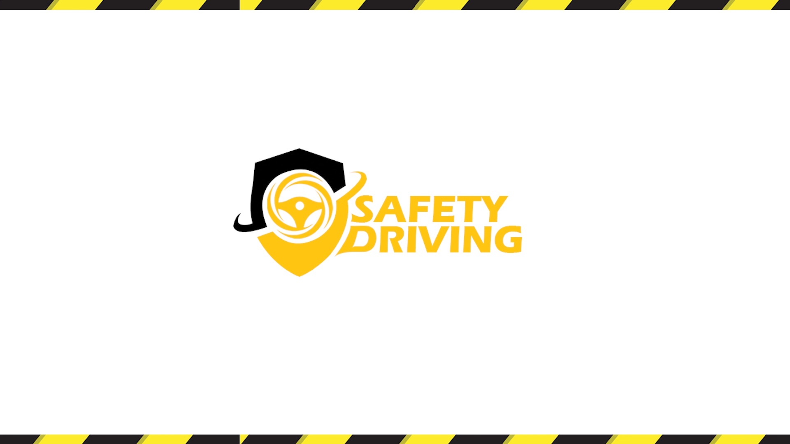
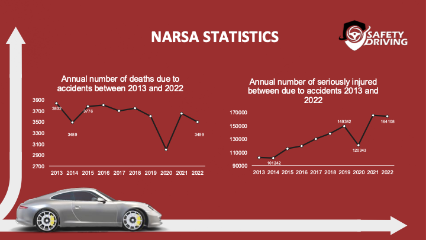
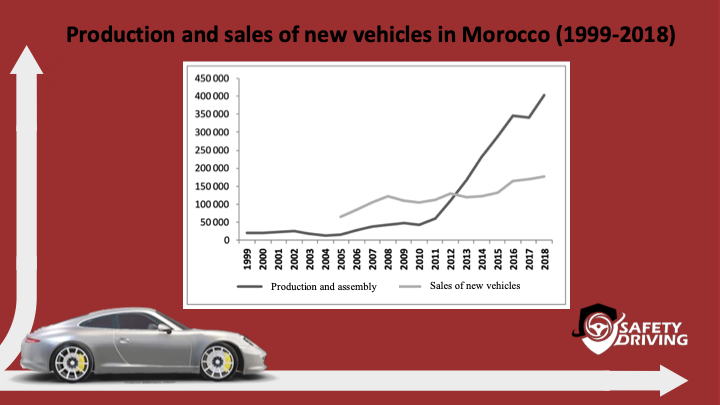

# **Safety Driving Project**

## **Background and Problem Statement:**

Every year, road accidents claim millions of lives globally and leave countless families devastated. In Morocco alone, over 4,000 people die annually, with more than 100,000 others sustaining serious injuries, according to the National Road Safety Agency (NARSA). Behind these statistics are human lives—parents, children, and friends—whose loss profoundly impacts their families and communities. Tragically, many of these deaths are preventable if only help could arrive in time. The challenge lies not only in the occurrence of accidents but also in the critical delay in emergency response. Often, precious minutes are wasted locating victims and alerting emergency services. This delay, though seemingly small, can make the difference between life and death, especially for those suffering from severe internal injuries. Adding to the tragedy is the silent threat of driver fatigue, which is responsible for a significant proportion of accidents, particularly on long routes. Exhausted drivers fail to recognize the onset of drowsiness, leading to fatal crashes. Despite advancements in automotive safety, there remains a gap in proactive and immediate solutions addressing both accident detection and fatigue prevention.




## **Impact and Proposed Solution:**

### **Impact:**
Safety Driving directly addresses two major road safety challenges: delayed emergency response and driver fatigue, which collectively contribute to thousands of preventable road accidents annually. In Morocco alone, road fatalities exceed 4,000 per year, with many accidents linked to drowsy driving or slow emergency intervention. Our solution has the potential to save lives, reduce injuries, and minimize the social and economic costs associated with these incidents.

- **Social Impact:** Lives saved through faster emergency response and prevention of drowsy driving accidents will alleviate emotional trauma for families and communities.
- **Economic Impact:** Lower accident rates will reduce medical expenses, insurance claims, and vehicle damage costs, benefiting both individuals and industries.
- **Cultural Shift:** The project raises awareness about driver fatigue, fostering safer driving habits and promoting a culture of responsibility on the road.



### **Proposed Solution:**
Safety Driving is a two-pronged system that combines:
1. **AI-Based Fatigue Detection:** The system uses a camera to monitor driver alertness in real time by analyzing blink patterns and eye movements. When fatigue is detected, it triggers alarms to prompt the driver to take action.
2. **Accident Detection and Real-Time Alerts:** Integrated shock sensors detect accidents and immediately send GPS-enabled location data to emergency responders, ensuring a rapid intervention.

These features offer a proactive and reactive approach to road safety, delivering measurable and meaningful results.

https://github.com/user-attachments/assets/39b60241-6e24-4738-9d18-27b0e601e509


## **Project Outcomes and Deliverables:**

### **Expected Outcomes:**
1. **Reduction in Road Traffic Fatalities and Injuries:**
   - A measurable decrease in road traffic fatalities due to quicker emergency response times facilitated by the Safety Driving system.
   - Fewer accident-related injuries, as both proactive fatigue detection and rapid emergency alerts reduce the severity of accidents and ensure timely intervention.
2. **Improved Driver Awareness and Behavior:**
   - Increased awareness of drowsy driving and its risks, leading to safer driving practices as a result of real-time fatigue monitoring and alerts.
   - Behavior changes such as more frequent breaks or rest stops to avoid fatigue-induced accidents.
3. **Faster Emergency Response Times:**
   - Faster medical intervention, improving the survival rates of accident victims due to the real-time geolocation and incident reporting system that instantly sends accident details to emergency services.
4. **Enhanced Vehicle Safety:**
   - Higher safety standards across vehicles with the integration of AI-based fatigue detection and automated accident reporting systems, creating an ecosystem of safer vehicles on the road.
5. **Technological Advancements and Innovation:**
   - A pioneering fusion of AI, IoT, and vehicle systems, leading to innovation in road safety technology and setting a new standard for vehicle safety systems in Morocco and beyond.
6. **Environmental Benefits:**
   - Reduced traffic congestion, as fewer accidents mean smoother traffic flow, which in turn leads to less fuel consumption and lower emissions from idling vehicles.
7. **Economic Impact:**
   - Lower costs for insurance providers, governments, and medical facilities by reducing accident-related expenses and improving overall public health outcomes.
8. **Scalability and Replication Potential:**
   - The system’s potential to scale across other regions and countries, with future adaptations for use in different types of vehicles and fleets.

### **Deliverables:**
1. **Functional Prototype:**
   - A fully operational Safety Driving system prototype, which includes both the accident detection and fatigue detection features.
   - A comprehensive demonstration of the system's real-time accident detection, GPS geolocation, and automated alert system.
2. **System Integration with Vehicle Infrastructure:**
   - Integration of the system with existing vehicle sensors and communication tools (like airbags, GPS, and onboard diagnostics) to enhance functionality and minimize installation costs.
3. **Pilot Test Results and Data:**
   - Data gathered from pilot testing the system in real-world conditions, with feedback from users, emergency responders, and stakeholders on system performance and usability.
4. **Public Awareness Campaign Materials:**
   - Campaign materials, including video demonstrations, infographics, and educational resources, designed to raise awareness about the system’s potential to save lives and reduce accidents.
5. **Training Materials:**
   - Training resources for vehicle owners, fleet operators, and emergency responders on how to use the system effectively and efficiently.
6. **Business and Marketing Plan:**
   - A comprehensive business and marketing strategy to guide the commercialization and scaling of the Safety Driving solution, including potential partnerships with insurance companies, vehicle manufacturers, and road safety authorities.
7. **Detailed Impact Assessment Report:**
   - A report that evaluates the impact of the system in terms of accident reduction, economic savings, user satisfaction, and environmental benefits, which can be used to attract investors and partners.

## **Instructions:**

### **Step-by-Step Guide to Run the Project:**

1. **Clone the Repository:**
   - Open a terminal and navigate to the directory where you want to store the project.
   - Clone the repository using the following command:
     ```bash
     git clone https://github.com/yourusername/safety-driving.git
     ```
   
2. **Install Dependencies:**
   - Navigate into the project directory:
     ```bash
     cd safety-driving
     ```
   - Install the necessary dependencies (ensure Python 3 and pip are installed):
     ```bash
     pip install -r requirements.txt
     ```

3. **Set Up the Camera for Fatigue Detection:**
   - Ensure that your system has access to a camera (either built-in or external).
   - Verify that OpenCV is correctly installed by running the following test:
     ```bash
     python -c "import cv2; print(cv2.__version__)"
     ```

4. **Configure the Accident Detection Sensors (Optional for Testing):**
   - If testing the accident detection feature, ensure that the shock sensors and GPS system are connected and configured.
   - For simulation purposes, accident events can be manually triggered by the system for testing.

5. **Run the System:**
   - Launch the system by running the main Python script:
     ```bash
     python main.py
     ```

6. **Test the Features:**
   - The system should now be running. You can test both the fatigue detection and accident detection features.
   - If fatigue is detected, the system will issue an alert.
   - If an accident is detected, the system will trigger the emergency response and send the GPS location.

7. **Monitor and Collect Data:**
   - Ensure that data logging is enabled to track system performance during tests. This can be configured in the `config.py` file.

8. **Further Configuration (Optional):**
   - Customize alert messages, sensitivity settings, and integrate with real-world emergency services APIs if necessary.
